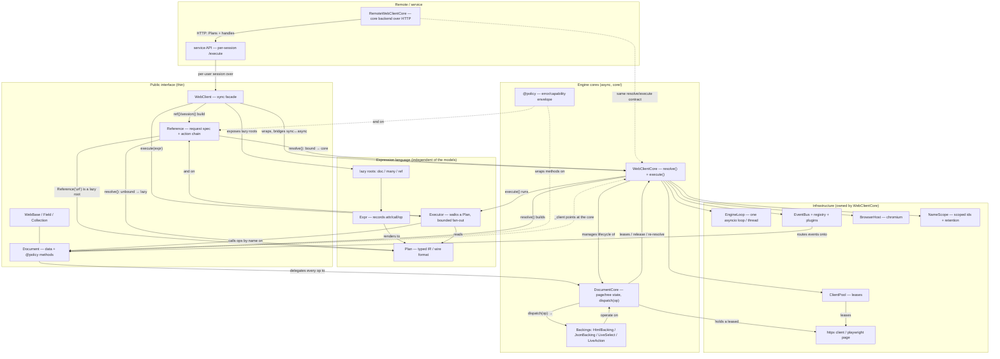

# Architecture

Two ideas organize the whole client:

1. **Interface vs. core.** The classes a user touches (`WebClient`,
   `Document`, `Reference`, `Field`, `Collection`) are thin. The machinery
   lives in cores (`WebClientCore`, `DocumentCore`) that interact with each
   other. The interface is stable; the cores are where behaviour varies.
2. **One expression language, two modes.** A lazy root (`doc`, `many`,
   `ref`) is an `Expr` that records a `Plan` (a typed, serialisable IR);
   an eager call runs the *same* op implementations through the core. They
   cannot drift because there is one implementation per op, dispatched by
   name — the `Plan` is also the wire format the remote client and service
   speak.

The sync `WebClient` and the async `AsyncWebClient` are thin skins over a
core's two async primitives -- **`resolve(reference) -> Document`** and
**`execute(expr) -> rows`** -- and the core is pluggable: a local
`WebClientCore` runs them in-process, a `RemoteWebClientCore` runs them on a
service over HTTP. Remote is a backend, not a separate client.

## Reading the diagram

- **`WebClient` → `WebClientCore`.** The facade forwards; the core owns the
  loop, pool, bus, plugins, browser and name scopes, and implements the two
  async primitives. An async or remote caller uses the same two.
- **`Reference.resolve()`** is a thin decision: bound → `WebClientCore
  .resolve` (build a `Document`, choose http vs browser, set ok/error, replay
  the recorded action chain); unbound → record a lazy `Plan`.
- **`Document` → `DocumentCore`.** The Document is data plus `@policy`
  methods; the core holds the page lease / live locator / parsed tree and
  the `dispatch(op)` that routes `select`/`attr`/`click`/… to the backing
  that serves the current medium. Backings read the core.
- **`Expr`/`Plan`** are independent of the models: `lazy(cls)` records any
  public attribute/call into a `Plan`; the `Executor` replays it by calling
  the real ops (no whitelist — only `_`-prefixed names are refused). The
  `Plan` is what the remote client and service exchange.
- **`EventBus`** correlates engine events (network, DOM, console, actions)
  onto the `Document` that caused them.

## Action chain (why re-resolution reproduces state)

A mutating action (`click`, `write`, …) records `{op, args}` onto the
document's `Reference.actions`. `doc.ref()` reflects that current chain, and
`reload()` re-resolves the reference — `WebClientCore.resolve` replays the
chain on the fresh page — so the result reproduces the mutated state. (This
was the critical bug: actions used to only emit events, leaving the chain
empty.)

## Where the code lives

| Concern | Module |
|---|---|
| Facades (sync/async) | `webclient/webclient.py` (`WebClient`, `AsyncWebClient`) |
| Shared facade + plan builders | `webclient/client.py` (`_Facade`, `plan_op`) |
| Engine core | `webclient/core/webclient.py` (`WebClientCore`) |
| Public models | `webclient/document.py` (`Reference`, `Document`, `Element`); base types re-exported from `core/base.py` |
| Base-type kernel | `webclient/core/base.py` (`WebBase`, `Field`, `Collection`, `NameScope`) |
| Document machinery | `webclient/core/document.py` (`DocumentCore`) |
| Backings (incl. core render) | `webclient/core/backings/` (`base`, `html`, `json`, `live`) |
| Error/capability policy | `webclient/core/base.py` (`@policy`) |
| Expression language | `webclient/lazy/expr.py` (`Expr`, `Plan`, roots), `webclient/lazy/executor.py` |
| Infra | `webclient/pool.py`, `webclient/events.py`, `webclient/engine/`, `webclient/plugins/` |
| Remote core backend | `webclient/core/remote.py` (`RemoteWebClientCore`) |
| Shared core loop lifecycle | `webclient/core/base.py` (`EngineCore`) |
| Service | `webclient/service/` |

## Current deviations from the target (staged, see PLAN §5d)

The staged review list is resolved: `Document` and `Reference` are siblings
off `WebBase`; the base types live in the `core/base.py` kernel;
representations are a single `render(format)` dispatched to backings (core
render is itself a backing op, not a plugin); remote is a lazy `Plan`
submitter over a per-session API; and the core is now `resolve` + `execute`
(plus the registry/lifecycle it owns), with the ergonomic plan builders
moved to a shared facade.

**One facade over a pluggable core; async by default.** `fetch`/`search`/
`summary` are free plan builders on `_Facade` (`webclient/client.py`); each
builds a `Plan` and hands it to `self._run`. The core is async-native:
`AsyncWebClient` awaits `core.execute`/`astream` on the caller's loop (no
engine thread), and `WebClient` is the one surface that bridges onto an
engine loop and blocks. The switch is `@policy._settle`, which returns the
awaitable whenever a loop is already running in the thread (the executor or
an async caller) and only bridges for a truly synchronous call.

**Remote is a core backend, not a separate client.** `RemoteWebClientCore`
implements the same core interface (`resolve`/`execute`/`astream`/`aclose`/
`_ensure_loop`/`session`) over HTTP, so `WebClient(core=RemoteWebClientCore(
url, token))` is the remote client and `Session` is backend-agnostic. A
document resolved server-side comes back as a shallow lazy handle (metadata
plus a bound lazy `Document` root via a document-source `Plan`); value ops
run through `execute` (one POST each), and no `Document` crosses the wire.
There are no `RemoteDocument`/`RemoteRef`/`RemoteSession` -- the lazy
`Document`/`Reference` interface and `Session` serve both backends.
